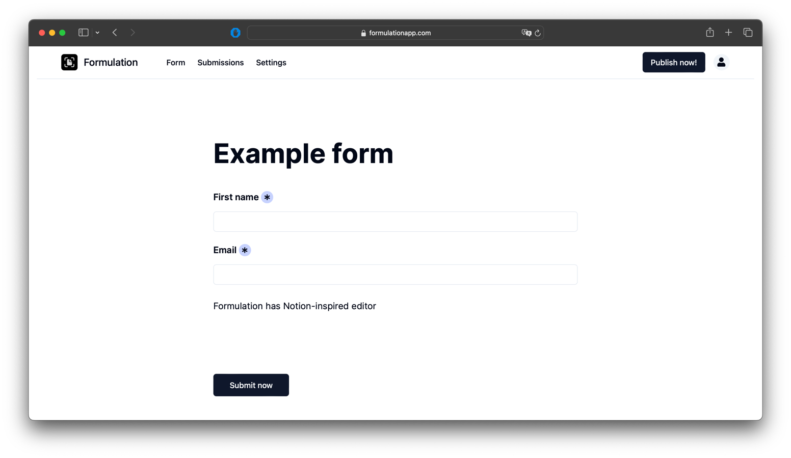

<h1 align="center"><b>📊 Formulation</b></h1>
<p align="center">
  An open-source, privacy-friendly Notion-inspired Form Builder
</p>
<p align="center">
  <a href="https://formulationapp.com" target="_blank">formulationapp.com</a>
</p>
<p align="center">
    
</p>



## Features
- [x] Notion-like Editor
- [x] Multiple types of questions (short/long text, choice, date, file, ...)
- [x] Convenient form submissions view
- [x] Multi-Tenancy (Workspaces)
- [ ] Export submissions to CSV
- [ ] User management
- [ ] Customizable
- [ ] Dark mode
- [ ] Custom domains
- [ ] Partial submissions
- [ ] Time-limited submissions
- [ ] Multiple languages support
- [ ] Customizable email notifications
- [ ] Integrations (Make, Zapier integrations)

## Getting started
```bash
git clone https://github.com/formulationapp/formulationapp.git
cd formulationapp
docker-compose up -d
```

Navigate to http://localhost:3008/register

## Motivation
Formulation aims to make forms accessible to everyone. It's a self-hosted alternative to Google Forms, Typeform, and other form builders.
Open-Source and privacy-friendly, Formulation is built with the latest technologies and is easy to deploy.
It is fast and can be used as a internal software for your company, where data security really matters.

## Contributing
Contributions are welcome! Feel free to open an issue or submit a pull request.